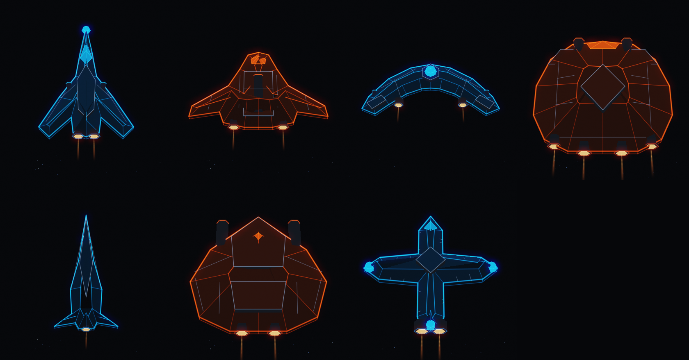
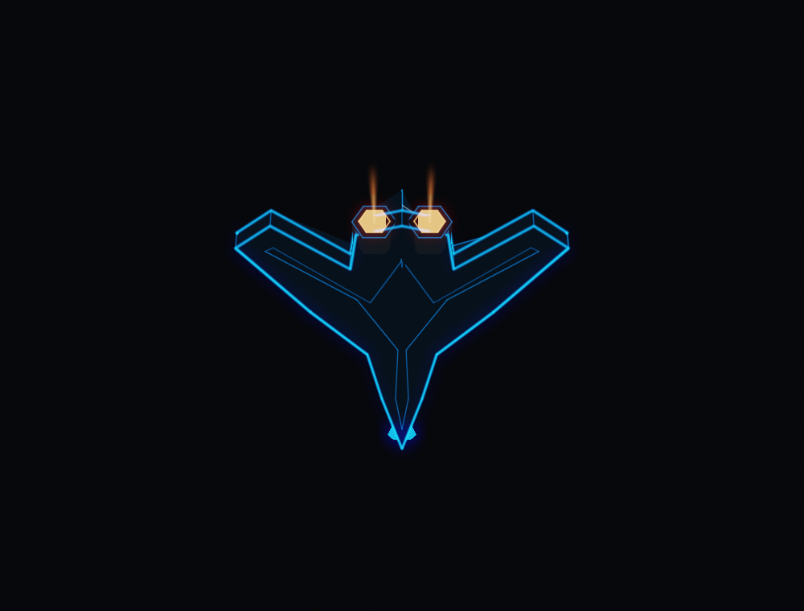
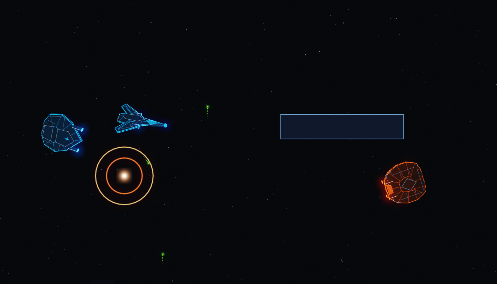
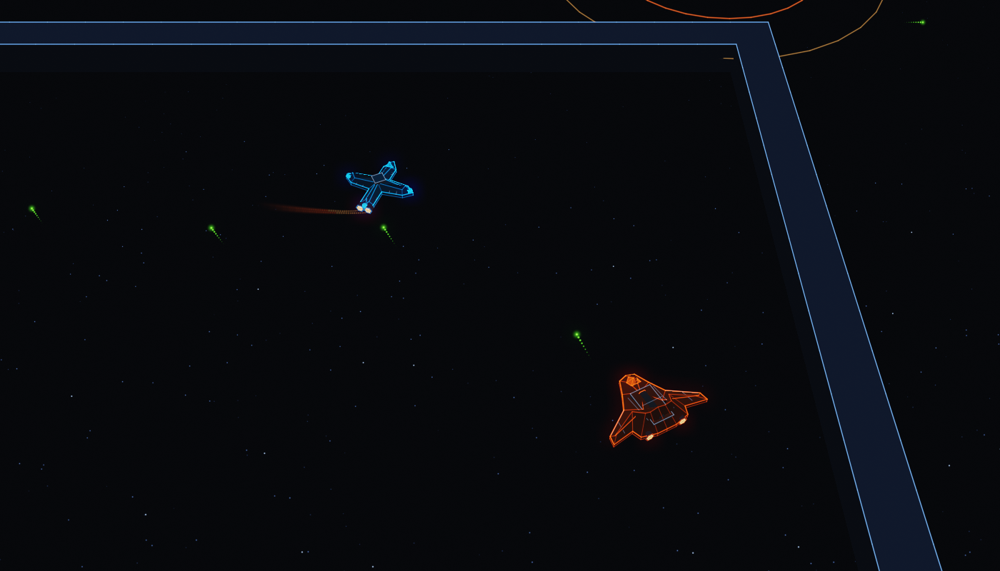
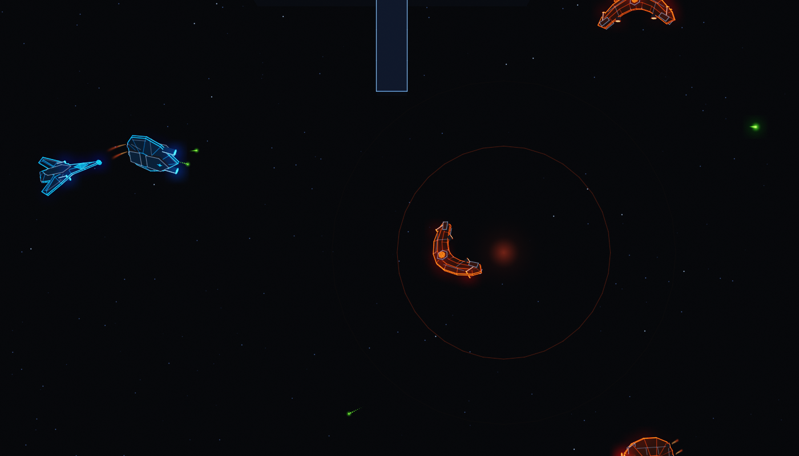
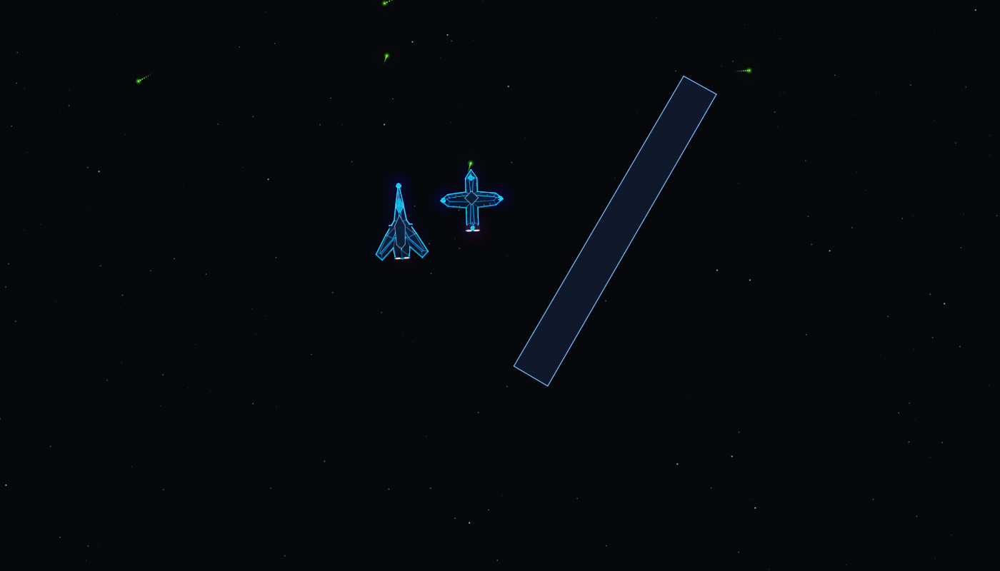
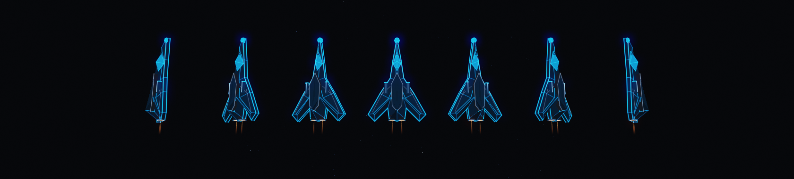
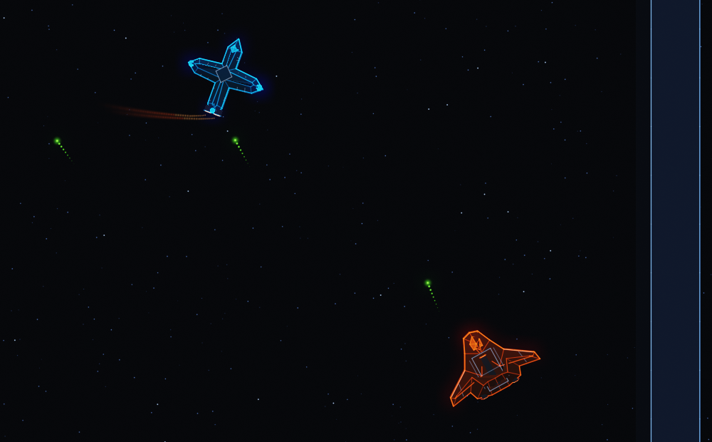
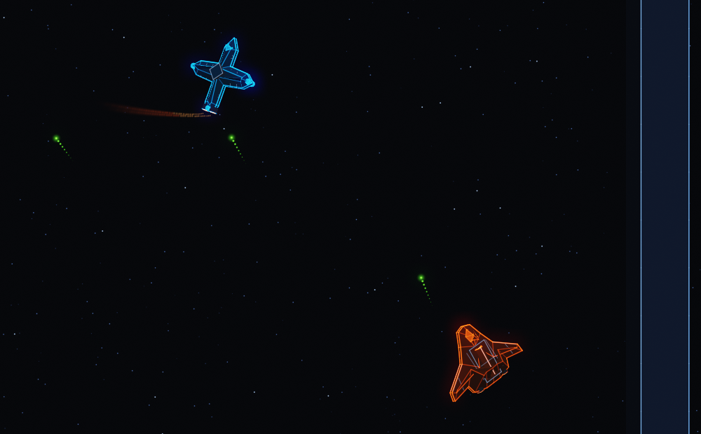

# Ships in three dimensions

A mock, and it stayed one. It asks what the seven hulls would look like with a
third dimension under them, and whether the game would still look like itself.

It went into the client once and came back out. The pictures below are made
with a perspective camera at a finite height, and the arena's is orthographic
and points straight down under a fixed zoom, which is decision 13 and is what
stops a resize from stretching the world. An orthographic camera pointed at a
plane draws a solid as its own plan: the hulls were genuinely solids in there,
and in the arena they looked exactly like the flat drawings they replaced.

Three things would have made the height visible and none of them earned its
place. A perspective lean draws a hull off where the core collides it. A drawn
deck fold is two more strokes per outline point on every ship in the room. A
bank only shows while somebody is turning. So the client draws what it drew
before, and this is the record of what the other answer looked like.

The answer this settles on is that the third dimension goes into the geometry
and nothing else. These are solids, occluding each other and the walls, seen
through a perspective camera; they are shaded the way `client/arena/world.lua`
shades a hull, which is to say not at all. There is no light in any of these
pictures. A face carries the fill it was given when it was built, the hull's
own nose lights its edges, and the outline is drawn as light over the top. A
lit, specular, shadow-casting version of the same meshes was the first thing
built here and it looked like a different game.



## What is drawn from what

Nothing here invents a ship. `hull_export.py` reads the seven hulls out of
`client/arena/world.lua`, applies the same `fit` the client applies at load,
and writes `hulls_data.h`. So a hull in these pictures has the outline, the
plates, the panel lines, the canopy, the hardpoints, the lamps and the engine
mouths the game already draws, sitting inside the footprint
`sim/src/baseline.c` gives its class.

The one invented number is height, and it is derived rather than drawn: the
crown is read off a distance field over the outline, so a hull stands tall
where it is wide and stays low where it is a wingtip or a nose. A roof is also
never allowed to be taller than the room it stands on, which is what keeps the
Apex's neck and the Lattice's arms from coming out as fins.

The fill is the client's own, taken from `world.lua` rather than picked:

```
body = team * 0.055 + (0.018, 0.026, 0.042)
wash = team * 0.20 * light
```

with `light` the nose-fixed edge light the flat client uses, generalized to a
face normal. Doing that sum in linear light rather than in display space adds
several times as much wash and turns every hull into a hologram, which is worth
saying because it is what happened first.

## The footprint still holds

Every hull spends exactly 625 square pixels of target area, and the drawing has
to sit on the box the core collides it in. That contract is
`sim/src/baseline.c`'s, and `client/tests/hull_fit_test.lua` holds the flat
client to it. A third dimension is not a licence to escape it, so `make check`
takes the same measurement on the meshes:

```
$ make check
hull     nose  box / drawn      tail  box / drawn      flank box / drawn      area px^2    diag    keel
Apex           20 / 20.69          11.25 / 12.25             10 / 11.00         625.000   22.36    0.24  ok
Wedge          11 / 12.00              9 / 10.00          15.62 / 16.62         625.000   19.11    0.23  ok
Chord           9 / 10.00              7 / 8.00           19.53 / 20.53         625.000   21.51    0.24  ok
Anvil          13 / 13.01             12 / 13.16           12.5 / 13.50         625.000   18.03    0.25  ok
Cipher         21 / 22.00          18.06 / 19.22              8 / 9.00          625.000   22.47    0.27  ok
Facet          13 / 14.00             12 / 13.16           12.5 / 13.50         625.000   18.03    0.23  ok
Lattice        13 / 14.00             12 / 12.74           12.5 / 13.26         625.000   18.03    0.34  ok
every hull spends the same 625 px^2, stays on its box, and keeps a flat keel
```

It measures every vertex of every part, hardpoints and lamps and engine bells
included, not just the outline: the furthest thing on a ship is not always on
its silhouette. Nothing in `hull3d.c` moves a vertex in x or y, and this is
what says so out loud rather than asking to be believed.

## The keel is flat

A hull has a deck and a floor. What the top does with a distance field the
bottom does barely at all: the underside is a keel plate a fraction of the
crown's depth, dark, with the same bright silhouette around it.

A mirrored hull stood here for one revision and it was the wrong shape, for a
reason worth leaving written down. Two identical faces make every class read
the same from either side, which sounds like the top-down argument and is
actually the opposite of one: somebody looking at a banked ship should be able
to tell they are seeing its belly.

What the mirror was solving is real, though, and the fix for it is smaller. A
ship holding 54 degrees of roll shows a viewer above it most of one face, and a
keel with no outline on it loses the silhouette halfway through every turn. So
the keel's outline draws as brightly as the deck's. It is the same edge of the
same shape, and the edge is where identity.md puts the class.



The hardpoints stayed where the mirror put them, on the deck rather than sunk
to the waterline, and that part was right for its own reason: at the waterline
a barrel sits inside the hull on every class whose tube runs down its spine,
and the Wedge's bomb tube, which is the brightest thing on that ship, vanished.

`make check` measures the keel as a fraction of the crown and fails a hull past
a third. All seven come out between 0.23 and 0.34.

## The battles are real ones

`vectorwake-server battlecap <zone> <seconds> <bots> <out.vwcap> [map] [seed]`
flies the arena's own brains on one of the zone's own maps, two teams, and
writes down every tick: positions, headings, what was in the air, and every
event the core raised. Nothing in a frame below was posed. The blast fronts are
at the radius the bomb that made them actually had, at the age the tick says,
and the engine trails are where the ship was on the ticks before.

`./mock3d pick <cap>` reads a recording back and says which moments are worth
drawing; `./mock3d kills <cap>` lists every kill with the frame a few ticks
after it, because by the time a blast is big enough to notice it is mostly
over.

Every frame below is straight down. That is where this game is played from and
nothing about the extra dimension asks to move the camera off it: a perspective
lens pointed at the floor gives you the sides of everything away from the
middle of the screen, so a wall reads as a slab you can be behind and a hull
away from the center shows its flank. The roster page above is the one picture
here taken from an angle, because a catalog is allowed to be.

A kill on convoy, nine ticks after the bomb:



A Lattice and a Wedge on switchyard, both of them holding a bank:



Four hulls and a fading blast on shoal:



Breakwater, eight in the room:



## Ships lean, and already did

A bank is not new here and is not a proposal. `ship_roll` in
`client/arena/arena.script` already reads one off the heading and hands it to
`world.ship`, which has nowhere to put it: a flat drawing has no axis to turn
about, so it scales the hull's local x by the cosine. A lean drawn as a squash.

So the meshes take that function's numbers to the digit and spend them on a
rotation instead. Read off the heading rather than off the buttons, because
buttons are yours alone and everybody's ship should lean into a turn; smoothed
on about a tenth of a second, because a remote heading arrives in snapshot
steps and a raw difference is a spike and four zeroes; three radians a second
of turn earns the whole bank; the whole bank is 0.95 radians, which is 54
degrees, past which a wing foreshortens faster than the eye reads it as a wing.



The same tick, without the bank and with it:




`ship_bank()` in `arena3d.c` is that rule, walking the recording's own heading
history so a frame shows the lean a client watching those ticks would be
holding.

There is a second attitude in there, off by default, behind `slip`. A hull in
this game can hold a heading while its momentum carries it sideways, and that
is the one attitude a turn rate cannot see: the nose is steady, `ship_roll`
reads zero, and the ship crabs across the screen flat. Leaning it into the
drift is a guess and is drawn only when asked for, since decision 5 is what
lets any of this be free, and the way to keep it free is to keep proposing
attitudes rather than smuggling them in.

Neither one touches the simulation. The core builds a collision box from the
world-axis bounds of an oriented rectangle at the ship's heading, and a rolled
hull's box is whatever the core says it is.

## Running it

```sh
make                 # the renderer
make check           # meshes against the collision boxes
make hulls           # re-read the hull art after editing world.lua
make meshes          # write meshes/*.obj

./mock3d sheet renders/roster.png 1680 880 1.02 0
./mock3d hull 4 cipher.png 900 900 0.95 0
./mock3d bank 0 strip.png 1680 380 1.42 0

# w h tilt dist turn focus-x focus-y bank slip; tilt 1.5708 is straight down
./mock3d battle battle.vwcap 842 kill.png 1400 800 1.5708 330 0 1003 -1554 1 0
```

The renderer is C99 with zlib for the PNG and nothing else: triangles, a
z-buffer, additive glow lines and a bloom. `r3.c` carries a directional light
and a shadow map that the flat path never calls, left in because the question
of whether these should be lit is the one thing here somebody might reasonably
answer the other way.

## What this does not answer

Whether the client should draw any of this. It draws five mesh layers of flat
vector art, the menu is vector because a Switch cannot composite a DOM over a
live frame, and none of that changes because a mock exists. Height is also a
gameplay claim nobody has made: the simulation collides an oriented rectangle
in a plane, and every hull here is exactly that rectangle seen from above.

`meshes/*.obj` are the seven hulls as plain geometry, if something else wants
to look at them.
