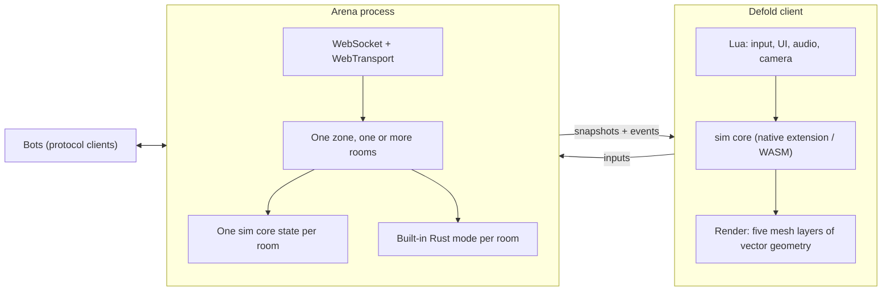

# vectorwake architecture

These documents describe how vectorwake is built and why. They assume you have
read [docs/research](../research/README.md), particularly
[implications.md](../research/implications.md), which is where most of these
decisions come from. For what the game is rather than how it is built, see
[docs/design](../design/README.md).

These started as proposals and are mostly no longer that. The simulation core,
the client, the authoritative server, bots, rating, the zone settings surface,
the fleet in [catalog.md](catalog.md), [discovery.md](discovery.md), and
[deployment.md](deployment.md), the accounts in
[meta-layer.md](meta-layer.md), and the operator panel in [admin.md](admin.md)
are built and running on vectorwake.net. [roadmap.md](roadmap.md) says what is
left. Each document marks historical plans where keeping them still explains a
decision.

| Document | Contents |
|---|---|
| [goals-and-constraints.md](goals-and-constraints.md) | What we are trying to build, what we refuse to trade away, what we are willing to lose |
| [system-overview.md](system-overview.md) | The pieces and how they fit: sim core, client, zone server, bots, directory, meta-layer |
| [platforms.md](platforms.md) | Browser, Steam, mobile, consoles: what each one costs us and in what order |
| [simulation-core.md](simulation-core.md) | The deterministic C core: fixed point, tick model, state layout, API |
| [client-defold.md](client-defold.md) | What Defold does for us, what it does not, project layout, map rendering, prediction |
| [server.md](server.md) | Authority, room and mode boundaries, lag response, persistence, operations |
| [zones-and-arenas.md](zones-and-arenas.md) | Historical deployment model that preceded on-demand rooms |
| [catalog.md](catalog.md) | The one artifact with an author: every zone, credential and ban, and what validation rejects |
| [discovery.md](discovery.md) | Registration, credentials, verification, the wire format, how a client finds a game |
| [admin.md](admin.md) | The operator web UI: what it observes, what it edits, what it may command |
| [meta-layer.md](meta-layer.md) | Accounts, session tokens, the rated event log, and the one service allowed a database |
| [hosting.md](hosting.md) | What a room costs, why the bill is egress, the provider choice, Docker, the meta-layer's database |
| [deployment.md](deployment.md) | The arrangement on a real host: Caddy, hostname routing, provisioning with nobody logged in |
| [networking.md](networking.md) | Transports, packet model, snapshots and inputs, lag response, anti-cheat |
| [ai-runtime.md](ai-runtime.md) | Where bots run, how they perceive and fly, and why they cannot cheat |
| [bot-calibration.md](bot-calibration.md) | Paired bot experiments, power, simultaneous intervals, multiplicity, equivalence, anchored strength, and reproducible holdouts |
| [content-pipeline.md](content-pipeline.md) | Settings, maps, assets, and how a zone author works |
| [decisions.md](decisions.md) | Numbered decision records with status and the argument for each |
| [roadmap.md](roadmap.md) | Milestones, in the order that retires the most risk |

## The short version

vectorwake is a top-down space MMO in the tradition of Subspace Continuum.
Frictionless inertial flight, energy as both health and ammunition, teams called
freqs, and arenas whose rules come from configuration rather than from our
source code.

A zone is one game backed by interchangeable arena processes, and a directory
serves many zones at once. One process serves one zone and grows rooms inside
that process up to the zone's `max_rooms` limit. [server.md](server.md) has the
current room model, while [zones-and-arenas.md](zones-and-arenas.md) records the
deployment model it replaced.

The architecture rests on one idea: the simulation is a small, deterministic,
fixed-point C library that both the client and the server run, tick for tick.

Defold renders and takes input. It does not own game state. The server is
authoritative over damage, deaths, flags, and scoring, which is the one place
where we deliberately break with the original.

## Why Defold

Defold is a good fit for the client and a poor fit for almost everything else,
and the architecture reflects that split.

What it gives us: a small fast 2D renderer, native extensions compiled by a
hosted build server for every target including WebAssembly, hot reload, and a
bundle size measured in single-digit megabytes. It also reaches every platform
we want, from a browser tab to Nintendo Switch, without a rewrite. For a game
whose visual budget is geometry on a tile grid, that is most of what a client
needs. See [platforms.md](platforms.md).

What it does not give us: a server. Defold can build a headless variant and
people do run game servers with it, but an arena process wants long uptime,
concurrent transports, predictable memory behavior under many connections, and
clean handoff to the directory and meta-layer. Those are not Defold's
strengths, and reaching for them would put our simulation inside a Lua VM whose
component update order the manual explicitly declines to specify.

So Defold is the client. The simulation is C. The server is its own Rust
program. [decisions.md](decisions.md) records the argument in full.
