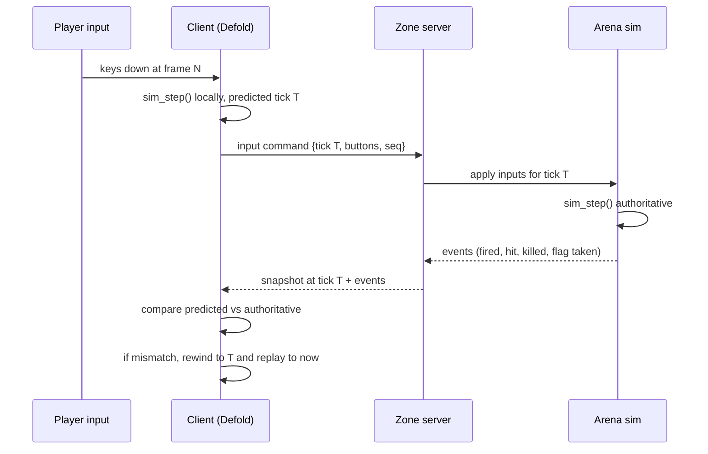
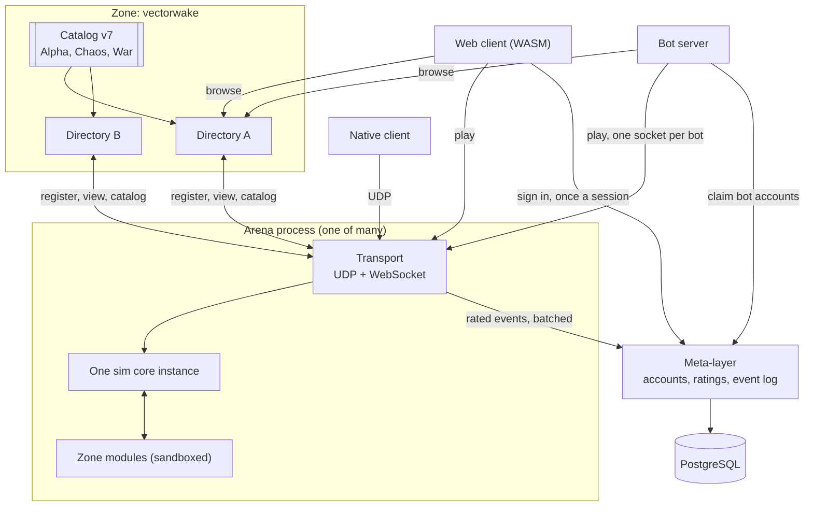

# System overview

## The pieces

**Simulation core** (`sim/`, C99). Deterministic, fixed-point, no allocation in
the hot path, no I/O, no knowledge of networking. Given a state and a set of
player inputs it produces the next state and a list of events. This is the only
place where game rules execute.

**Client** (`client/`, Defold + Lua + the sim core as a native extension).
Reads input, runs the sim core forward for local prediction, interpolates
everyone else, and draws the result. Owns no authoritative state.

**Arena server** (`server/`, native binary). Accepts connections, runs one sim
core instance at a fixed tick, decides everything that matters, and emits rated
events for the meta-layer to keep. Hosts sandboxed zone modules that observe and
adjust the rules. It holds nothing durable of its own but its instance id. One
process holds one arena; a zone is many of them plus the directories that list
them, per [zones-and-arenas.md](zones-and-arenas.md).

**Zone modules** (`modules/`, sandboxed WebAssembly or Lua). Game modes, event
logic, and anything a zone author wants to add. They receive events and may
answer questions the server asks, in the shape of ASSS's adviser pattern.

**Bot server** (one per deployment). Flies the AI roster as ordinary clients:
one process, many WebSocket connections, each bot decoding the arena's
snapshots through the sim core and sending the same input messages a human
sends. It fills rooms to each zone's `bot_fill` and stands bots down as humans
arrive. There is no other kind of bot: third-party bots use the same protocol
and the same JOIN declaration, with a fleet credential setting the house
roster apart where trust matters. See [ai-runtime.md](ai-runtime.md),
[design/ai-players.md](../design/ai-players.md), and
[decision 29](decisions.md#29-a-bot-is-a-client).

**Meta-layer** (`server/`, same binary, `meta` subcommand). Accounts,
credentials, call signs, the rated event log and the rating projection it
feeds, on PostgreSQL. The only process in the fleet with a database behind it,
and the only one nothing else has to be able to reach: it mints signed session
tokens that arenas verify offline, so an outage costs persistence rather than
play. See [meta-layer.md](meta-layer.md) and
[design/accounts.md](../design/accounts.md).

**Directory** (`server/`, same binary, `directory` subcommand). The front door for
many zones: it holds every zone's configuration and the token table, accepts arena
server registrations, verifies the addresses they claim, and answers browse
requests. It assigns nothing. An arena server that cannot reach one keeps serving
whatever it last chose. See [discovery.md](discovery.md).

**Admin UI** (static HTML). Reads the same view an arena server reads and edits
the catalog, which is the whole of its authority. See [admin.md](admin.md).

## How a frame moves through the system

The client never waits for the server to move its own ship. It waits for the
server only to learn whether a shot connected.

## Process and deployment shape

One process holds one arena, or several of them where a zone says so: a room is
107 KB and steps in microseconds, so the catalog caps rooms per process per zone
and a duel zone grows up to a hundred where War stays at one. A zone is a named
game, one configuration plus however many arena servers are running it, and a
directory serves many zones at once. Scaling is a replica count. Where those
replicas run, what they cost, and why the bill is egress rather than compute is
[hosting.md](hosting.md).

This reverses the structure that let Subspace feel like one social space on a
tiny budget, and [decision 23](decisions.md) argues the trade with its costs
named.

Nothing on the join path touches the meta-layer. A client signs in once and
carries a signed token; the arena checks the signature against a key the
catalog delivered, so the only arrow from an arena to the meta-layer is rated
events leaving, and it never blocks a tick.

Settings, map and simulation are per process, and none of them are durable. The
catalog, bans and staff capabilities are deployment-wide and arrive from a
directory; identity, ratings and the rated event log belong to the meta-layer.
Moving between arenas is a reconnect, which is the sharpest thing this model gives
up.

## Threading

The transport layer runs on its own thread and hands the arena a queue of decoded
inputs. The arena ticks on one thread, and since the process holds a single arena
there is no pool and nothing to schedule. Rated events go to a local spool file and a
background task drains them to the meta-layer, so a tick waits on neither a
disk seek nor a network round trip.
The registration client runs on the async runtime alongside the transport and
never blocks a tick.

The sim core is single-threaded by construction and holds no globals, so an arena
is a plain value one thread owns for the duration of a tick. This falls out of
writing the core as a pure function rather than as an engine.

## Tick rates and time

The simulation runs at 100 Hz, matching Subspace's centisecond tick, because
weapon delays, energy costs, and recharge rates in thirty years of published
zone settings are expressed in those units. Rendering runs at whatever the
display does. The client interpolates between the last two authoritative states
for remote players and predicts its own.

Snapshots go out at a lower rate than the tick, defaulting to 20 Hz, with
position for nearby players sent more often than for distant ones. See
[networking.md](networking.md).

## Where each Subspace idea landed

| Subspace concept | Where it lives here |
|---|---|
| Zone | A named game: one configuration plus the arena servers running it |
| Arena | One process: a sim core instance plus its settings and map |
| Named arena (`pub1`, `?go`) | Deleted. A player picks a zone and the client picks the arena server |
| Directory server | A zone's own front door, not a global list of zones |
| Freq | A team id inside arena state |
| `arena.conf` settings | Configuration compiled into a settings struct the sim core reads |
| Flag and ball game modules | Zone modules, sandboxed |
| Capabilities | Named powers in the catalog, gating the admin channel |
| `data.db` per zone | Deleted. Arena servers are disposable; durable state is the meta-layer's |
| Lag actions | Server, between transport and arena |
| Client-authoritative death | Deleted. The arena decides |
| `.lvl` maps | Imported to our map format, drawn as vector geometry rather than tiles |
| Bots | Declared clients on the ordinary protocol; the house roster flies from the bot server |
| Nothing equivalent | Skill rating, computed from arena events outside the simulation |
