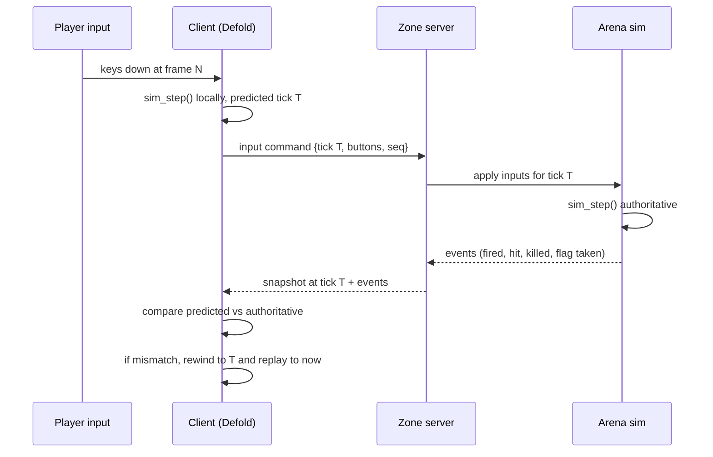
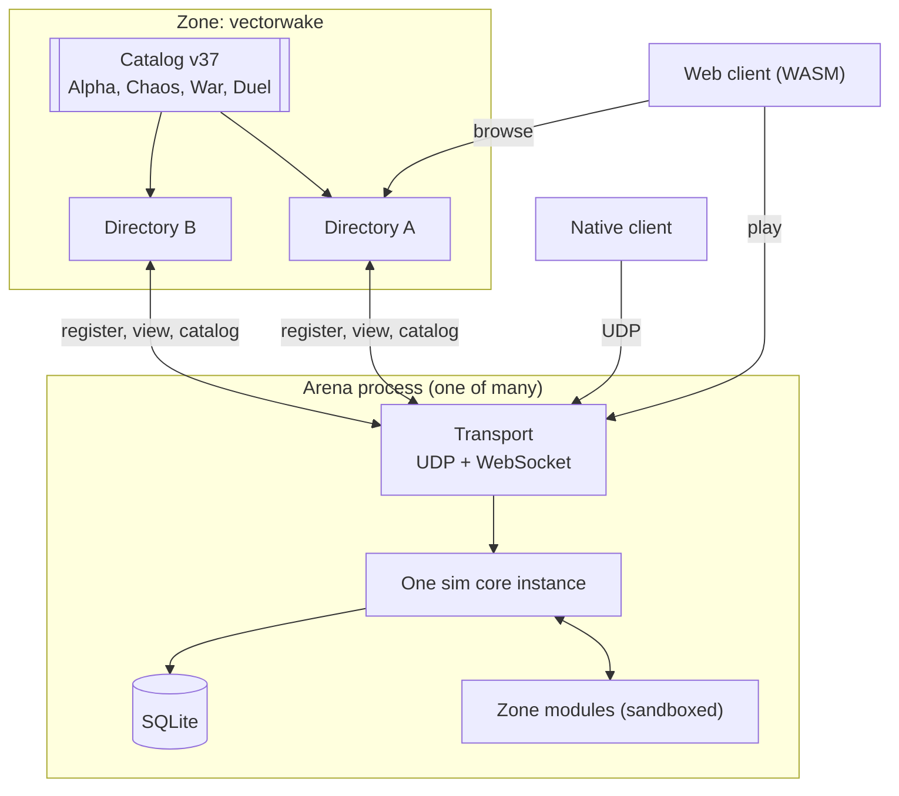

# System overview

## The pieces

**Simulation core** (`sim/`, C99). Deterministic, fixed-point, no allocation in
the hot path, no I/O, no knowledge of networking. Given a state and a set of
player inputs it produces the next state and a list of events. This is the only
place where game rules execute.

**Client** (`client/`, Defold + Lua + the sim core as a native extension).
Reads input, runs the sim core forward for local prediction, interpolates
everyone else, and draws the result. Owns no authoritative state.

**Arena server** (`server/`, native binary). Accepts connections, runs one sim
core instance at a fixed tick, decides everything that matters, and writes scores
to a database. Hosts sandboxed zone modules that observe and adjust the rules.
One process holds one arena; a zone is many of them plus the directories that
list them, per [zones-and-arenas.md](zones-and-arenas.md).

**Zone modules** (`modules/`, sandboxed WebAssembly or Lua). Game modes, event
logic, and anything a zone author wants to add. They receive events and may
answer questions the server asks, in the shape of ASSS's adviser pattern.

**AI players** (`server/ai/`). Bots that fill an arena when humans are scarce and
leave as humans arrive. They run in the arena's tick and emit the same input
commands a network client does, so they cannot cheat. See
[ai-runtime.md](ai-runtime.md) and [design/ai-players.md](../design/ai-players.md).

**External bots.** Programs that connect over the same protocol as players, with
elevated rights granted by capability. Reading Subspace taught us that most
zone identity lives in bots, so they are a supported interface rather than a
side effect. Distinct from AI players: these are tooling and league logic, not
opponents.

**Directory** (`server/`, same binary, `directory` subcommand). A zone's front
door: it holds the catalog of arena types and the token table, accepts arena
registrations, verifies the addresses they claim, and answers browse requests. It
assigns nothing. An arena that cannot reach one keeps running whatever it last
chose. See [discovery.md](discovery.md).

**Admin UI** (static HTML). Reads the same fleet view an arena reads and edits
the catalog, which is the whole of its authority. See [admin.md](admin.md).

## How a frame moves through the system

The client never waits for the server to move its own ship. It waits for the
server only to learn whether a shot connected.

## Process and deployment shape

One process holds one arena. A zone is a catalog of arena types, one or more
directories serving it, and however many arena processes are running. Scaling is
a replica count.

This reverses the structure that let Subspace feel like one social space on a
tiny budget, and [decision 23](decisions.md) argues the trade with its costs
named.

Settings, map, simulation and scores are per process. The catalog, bans, and
staff capabilities are zone-wide and arrive from a directory. Moving between
arenas is a reconnect, which is the sharpest thing this model gives up.

## Threading

The transport layer runs on its own thread and hands the arena a queue of decoded
inputs. The arena ticks on one thread, and since the process holds a single arena
there is no pool and nothing to schedule. Database writes go to a separate thread
behind a queue. The registration client runs on the async runtime alongside the
transport and never blocks a tick.

The sim core is single-threaded by construction and holds no globals, so an arena
is a plain value one thread owns for the duration of a tick. This falls out of
writing the core as a pure function rather than as an engine.

## Tick rates and time

The simulation runs at 100 Hz, matching Subspace's centisecond tick, because
weapon delays, energy costs, and recharge rates in thirty years of published
zone settings are expressed in those units. Rendering runs at whatever the
display does. The client interpolates between the last two authoritative states
for remote players and predicts its own.

Snapshots go out at a lower rate than the tick, defaulting to 20 Hz, with
position for nearby players sent more often than for distant ones. See
[networking.md](networking.md).

## Where each Subspace idea landed

| Subspace concept | Where it lives here |
|---|---|
| Zone | A catalog of arena types plus the directories that serve it |
| Arena | One process: a sim core instance plus its settings and map |
| Named arena (`pub1`, `?go`) | Deleted. A player picks an arena type and the client picks the instance |
| Directory server | A zone's own front door, not a global list of zones |
| Freq | A team id inside arena state |
| `arena.conf` settings | Configuration compiled into a settings struct the sim core reads |
| Flag and ball game modules | Zone modules, sandboxed |
| Capabilities | Server-side player registry, unchanged in spirit |
| Lag actions | Server, between transport and arena |
| Client-authoritative death | Deleted. The arena decides |
| `.lvl` maps | Imported to our map format, rendered through Defold tilemaps |
| Bots | Two kinds: in-process AI opponents, and protocol clients with capability grants |
| Nothing equivalent | Skill rating, computed from arena events outside the simulation |
