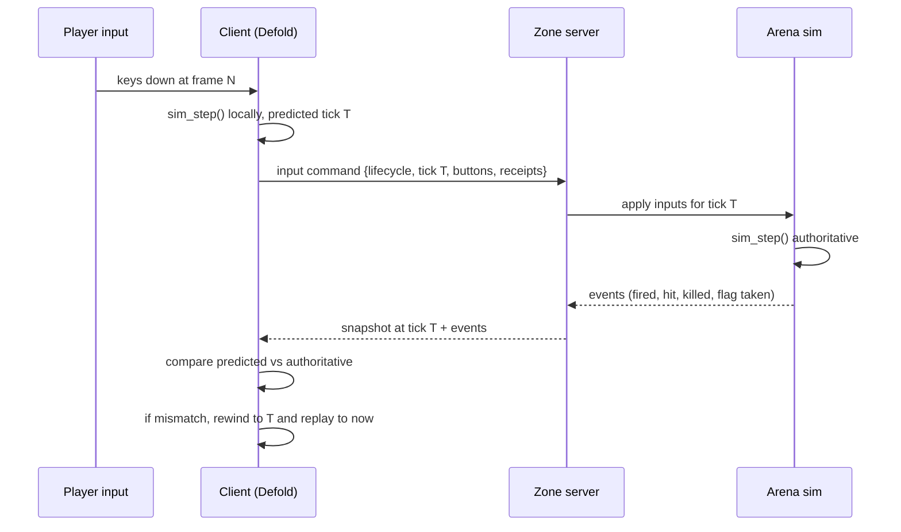
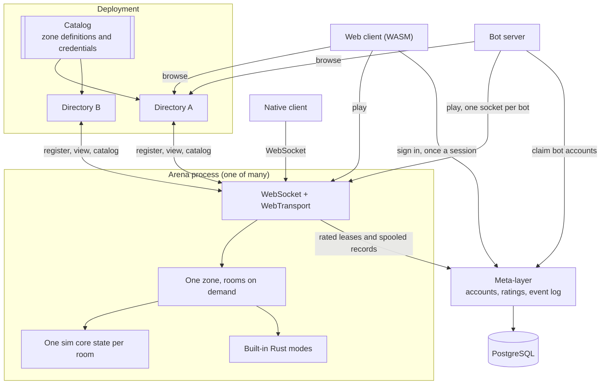

# System overview

## The pieces

**Simulation core** (`sim/`, C99). Deterministic, fixed-point, no allocation in
the hot path, no I/O, no knowledge of networking. Given a state and a set of
player inputs it produces the next state and a list of events. Movement, combat,
objectives, and inventory rules execute here; room admission, scoring, and match
flow sit around it in the server.

**Client** (`client/`, Defold + Lua + the sim core as a native extension).
Reads input, runs the sim core forward for local prediction, interpolates
everyone else, and draws the result. Owns no authoritative state.

**Arena server** (`server/`, native binary). Accepts connections, runs one sim
core state per room at a fixed tick, decides everything that matters, and emits
rated events for the meta-layer to keep. The built-in Rust modes in `modes.rs`
own scoring and match flow outside the simulation core. A process serves one
zone and grows rooms on demand up to that zone's `max_rooms` limit. Its local
disk holds an instance id and outbound event spools, not authoritative records.
See [server.md](server.md) for the current room model.

**Bot server** (`server/`, same binary, `bots` subcommand). Flies the AI roster
as ordinary clients: one process, many WebSocket connections, each bot decoding
the arena's snapshots through the sim core and sending the same input messages
a human sends. It fills rooms to each zone's `bot_fill` and stands bots down as humans
arrive. There is no other kind of bot: third-party bots use the same protocol
and the same JOIN declaration, with a fleet credential setting the house
roster apart where trust matters. See [ai-runtime.md](ai-runtime.md),
[design/ai-players.md](../design/ai-players.md), and
[decision 29](decisions.md#29-a-bot-is-a-client).

**Meta-layer** (`server/`, same binary, `meta` subcommand). Accounts,
credentials, call signs, the rated event log and the rating projection it
feeds, on PostgreSQL. The only process in the fleet with a database behind it,
it mints signed session tokens that arenas verify offline. Arenas reach it at
the connection boundary to claim and renew rated seats, but a room tick never
waits on it. See [meta-layer.md](meta-layer.md) and
[design/accounts.md](../design/accounts.md).

**Directory** (`server/`, same binary, `directory` subcommand). The front door for
many zones: it holds every zone's configuration and the token table, accepts arena
server registrations, verifies the addresses they claim, and answers browse
requests. It assigns nothing. An arena server that cannot reach one keeps serving
whatever it last chose. See [discovery.md](discovery.md).

**Admin UI** (`deploy/admin/`, served by the meta-layer). Shows fleet and account
state, checks and edits maps, changes rotations, and sends the bounded operator
commands described in [admin.md](admin.md).

## How a frame moves through the system

The client never waits for the server to move its own ship. It waits for the
server only to learn whether a shot connected.

## Process and deployment shape

One arena process serves one zone and holds one or more rooms for it. A room
appears only when every live room in the process has reached its fill target,
and empty rooms beyond the first are reclaimed. The catalog caps both rooms per
process and processes per pool. A directory serves many zones at once, and an
arena process may choose a different zone after its last player leaves. Where
the processes run, what they cost, and why the bill is egress rather than
compute is [hosting.md](hosting.md).

This reverses the structure that let Subspace feel like one social space on a
tiny budget, and [decision 23](decisions.md) argues the trade with its costs
named.

A client signs in once and carries a signed token, whose identity the arena
checks offline against a catalog key. An authenticated flying join also claims
the account's one rated lease from the meta-layer. New rated sessions are
refused while that exclusion check is unavailable; guests can still enter, and
existing leases have enough renewal slack for a short outage. Rated and match
records leave through durable spools. None of these calls blocks a room tick.

Settings are per zone, while map position and simulation state are per room;
none is durable. The catalog, bans and staff capabilities are deployment-wide
and arrive from a directory. Identity, ratings and the event log belong to the
meta-layer. Moving between arena processes is a reconnect, which is the
sharpest thing this model gives up.

## Threading

Socket sessions, directory registration, WebTransport, and spool delivery run
as asynchronous tasks. One 100 Hz loop steps every live room in order. Rooms
are cheap enough that a worker pool would add coordination without buying useful
parallelism. Rated events go to local spool files and background tasks drain
them to the meta-layer, so a tick waits on neither a disk seek nor a network
round trip.

The sim core is single-threaded by construction and holds no globals, so a room
is an explicit state value the tick loop owns while stepping it.

## Tick rates and time

The simulation runs at 100 Hz, matching Subspace's centisecond tick, because
weapon delays, energy costs, and recharge rates in thirty years of published
zone settings are expressed in those units. Rendering runs at whatever the
display does. The client interpolates between the last two authoritative states
for remote players and predicts its own.

Snapshots go out at 20 Hz outside combat and 50 Hz when a hostile hull or
projectile is nearby. Each is a complete state replacement inside the server's
fixed fairness circle. See [networking.md](networking.md).

## Where each Subspace idea landed

| Subspace concept | Where it lives here |
|---|---|
| Zone | A named game: one configuration plus the arena servers running it |
| Arena | A room: one sim core state, map, mode, and roster inside an arena process |
| Named arena (`pub1`, `?go`) | Deleted. A player picks a zone and the client picks the arena server |
| Directory server | One deployment's front door, listing every zone in its catalog |
| Freq | A team id inside arena state |
| `arena.conf` settings | Configuration compiled into a settings struct the sim core reads |
| Match and flag modes | Built-in Rust modes around the simulation core |
| Capabilities | Named powers in the catalog, gating the admin channel |
| `data.db` per zone | Deleted. Arena servers are disposable; durable state is the meta-layer's |
| Lag actions | Server, between transport and arena |
| Client-authoritative death | Deleted. The arena decides |
| `.lvl` maps | Convertible for collision research; shipped maps are authored here |
| Bots | Declared clients on the ordinary protocol; the house roster flies from the bot server |
| Nothing equivalent | Skill rating, computed from arena events outside the simulation |
