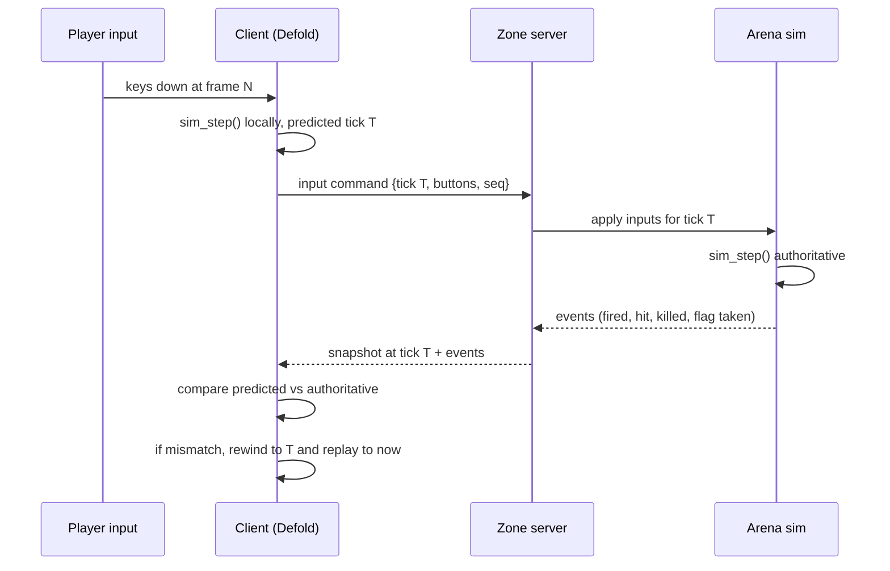
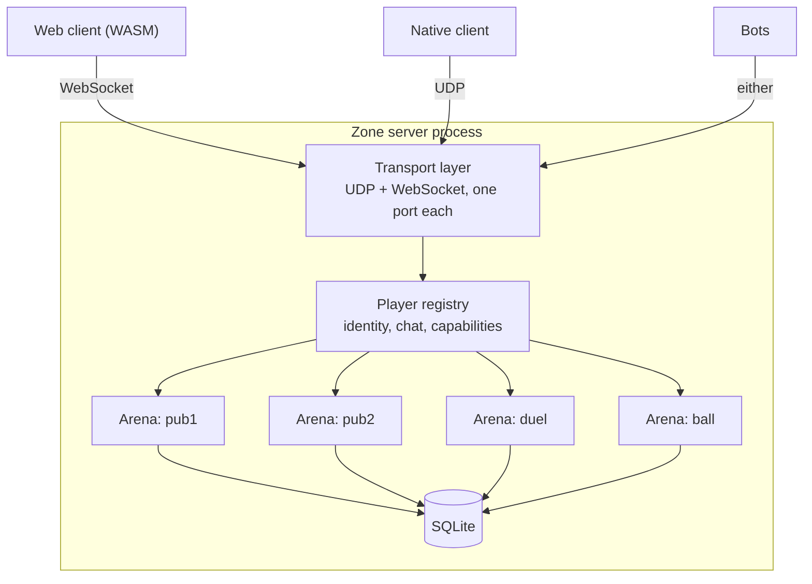

# System overview

## The pieces

**Simulation core** (`sim/`, C99). Deterministic, fixed-point, no allocation in
the hot path, no I/O, no knowledge of networking. Given a state and a set of
player inputs it produces the next state and a list of events. This is the only
place where game rules execute.

**Client** (`client/`, Defold + Lua + the sim core as a native extension).
Reads input, runs the sim core forward for local prediction, interpolates
everyone else, and draws the result. Owns no authoritative state.

**Zone server** (`server/`, native binary). Accepts connections, places players
in arenas, runs one sim core instance per arena at a fixed tick, decides
everything that matters, and writes scores to a database. Hosts sandboxed zone
modules that observe and adjust the rules.

**Zone modules** (`modules/`, sandboxed WebAssembly or Lua). Game modes, event
logic, and anything a zone author wants to add. They receive events and may
answer questions the server asks, in the shape of ASSS's adviser pattern.

**AI players** (`server/ai/`). Bots that fill an arena when humans are scarce and
leave as humans arrive. They run in the arena's tick and emit the same input
commands a network client does, so they cannot cheat. See
[ai-runtime.md](ai-runtime.md) and [design/ai-players.md](../design/ai-players.md).

**External bots.** Programs that connect over the same protocol as players, with
elevated rights granted by capability. Reading Subspace taught us that most
zone identity lives in bots, so they are a supported interface rather than a
side effect. Distinct from AI players: these are tooling and league logic, not
opponents.

**Directory.** A small service listing live zones for the client's server
browser. Optional, and a zone runs fine without it.

## How a frame moves through the system

The client never waits for the server to move its own ship. It waits for the
server only to learn whether a shot connected.

## Process and deployment shape

One zone server process hosts many arenas. Arenas are independent simulations
that share a process, a socket, and a player list, which is exactly the
structure that let Subspace feel like one social space on a tiny budget.

Chat, player identity, and arena listings are process-wide. Simulation,
settings, maps, and scores are per-arena. Moving between arenas does not
reconnect.

## Threading

The transport layer runs on its own thread and hands each arena a queue of
decoded inputs. Each arena ticks on a worker from a pool, one arena to one
thread at a time, so an arena's simulation never runs concurrently with itself
and never blocks another arena. Database writes go to a separate thread behind a
queue.

The sim core is single-threaded by construction and holds no globals, so an
arena is a plain value that a worker owns for the duration of a tick. This falls
out of writing the core as a pure function rather than as an engine.

## Tick rates and time

The simulation runs at 100 Hz, matching Subspace's centisecond tick, because
weapon delays, energy costs, and recharge rates in thirty years of published
zone settings are expressed in those units. Rendering runs at whatever the
display does. The client interpolates between the last two authoritative states
for remote players and predicts its own.

Snapshots go out at a lower rate than the tick, defaulting to 20 Hz, with
position for nearby players sent more often than for distant ones. See
[networking.md](networking.md).

## Where each Subspace idea landed

| Subspace concept | Where it lives here |
|---|---|
| Zone | One server process |
| Arena | One sim core instance plus its settings and map |
| Freq | A team id inside arena state |
| `arena.conf` settings | Configuration compiled into a settings struct the sim core reads |
| Flag and ball game modules | Zone modules, sandboxed |
| Capabilities | Server-side player registry, unchanged in spirit |
| Lag actions | Server, between transport and arena |
| Client-authoritative death | Deleted. The arena decides |
| `.lvl` maps | Imported to our map format, rendered through Defold tilemaps |
| Bots | Two kinds: in-process AI opponents, and protocol clients with capability grants |
| Nothing equivalent | Skill rating, computed from arena events outside the simulation |
