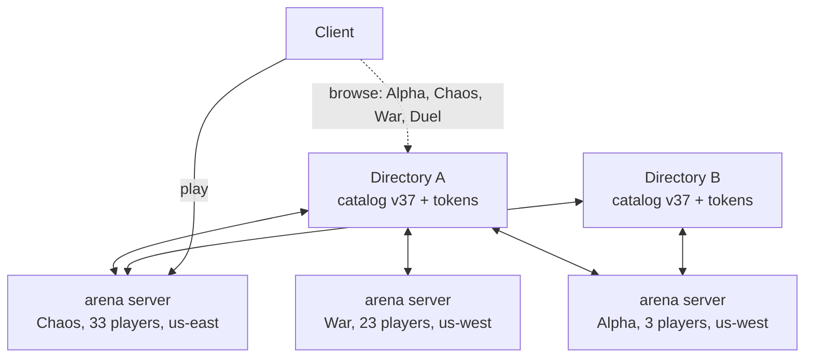

# Zones, directories, and arena servers

## The thesis

The directory observes and reports. The edges decide.

An arena server decides which zone it serves. A client decides which arena
server it joins. Nothing in the middle assigns work, which means nothing in the
middle has to be elected, agreed with, or kept alive for the game to continue.

Everything below follows from that sentence, including the parts that look like
inconveniences.

## Vocabulary

**Zone.** A named game: one configuration, plus however many arena servers are
running it. Alpha, Chaos, War, Duel. This is what a player picks from a list,
and it is what the original's directory listed.

**Arena server**, or **arena**. One process running one zone's configuration:
one map, one mode, one simulation, one tick loop at 100 Hz. Interchangeable with
every other arena server running the same zone.

**Directory.** The front door for many zones. It holds every zone's
configuration, the token table, and a live registration from every arena server,
which between them are serving a mix of zones. A deployment runs several
directories for availability, and anyone may run their own. Directories never
talk to each other.

**Catalog.** The set of zone configurations a directory serves, versioned as a
unit.

**Pool.** An operator's block of arena-server capacity, authorised by one row of
the token table and bounded by an instance cap.

Pools and zones are orthogonal, and it is worth saying so plainly because the
containment reads either way until you check. A pool is *whose capacity this
is*; a zone is *what game is being played on it*. Arena servers in one pool will
be serving different zones, and a busy zone is normally served by arena servers
drawn from several pools.



An arena server registered with both directories carries each one's observations
to the other. The shared picture propagates through the workers rather than
between the controllers, which is why no directory needs a peer list.

One thing this vocabulary gives up. In Subspace a zone held several arenas with
different maps, so Trench Wars was one zone containing a public room, a duel
room and a league room. Here each of those is a zone, and what used to be their
grouping is now just several zones a directory lists next to each other. The
social unity that grouping implied is already gone with
[decision 23](decisions.md), so this costs nothing that was still standing.

## What each layer owns

| | Owns | Does not own |
|---|---|---|
| Catalog | Every zone's map, mode, settings and fill target. Bans and staff. Versioned. | Anything about a running arena server |
| Directory | Token table, its own observations, browse answers | Which zone anybody serves, player state, durable records |
| Arena server | One simulation, its choice of zone, its players | The catalog, other arena servers |
| Client | Which directory to ask, which arena server to join | Nothing authoritative, as before |

## The arena server lifecycle

An arena server boots knowing two things: the directories it should register
with, and its token for each. Nothing else, which is the property that makes a
deployment one container image and a horizontal scale a non-event.

1. **Register.** Connect to each directory over TLS, present the token, hold the
   socket open. The directory names the pool from the token row, so an arena
   server cannot claim to be somebody else's capacity.
2. **Learn.** Each directory pushes what it has observed: every arena server it
   holds a registration for, with the zone it serves, its verified player count,
   its region, and an observation timestamp. The arena server unions these and
   deduplicates by instance id, keeping the most recent observation of each.
3. **Choose a zone.** Apply the selection rules below. Fetch that zone's map and
   settings, which arrive as the same packed bytes a client receives at join.
4. **Serve.** Tick at 100 Hz, push status updates as counts change, answer
   direct status queries.
5. **Drain and re-choose.** Stop accepting joins, let the room empty, then go
   back to step 3.

An arena server that cannot reach any directory keeps serving whatever it last
chose. One that has never reached a directory serves the catalog's default zone,
or the built-in arena if it has no catalog at all. Neither case is an error worth
exiting over.

## Choosing a zone

Every arena server applies the same rule to nearly the same data, which is
exactly the condition under which a correct local decision becomes a bad global
outcome. Four rules keep that from happening.

**Only an empty arena server chooses.** Switching zone means a new map and a new
mode, so it disconnects everyone in the room. An arena server that wants to
change drains first. This is the rule that makes the rest of the design safe
rather than merely clever: instances may flap all they like while nobody is
affected, and drain time rate-limits decisions for free.

**Prefer not to exist.** An arena server opens a new instance of a zone only when
every live instance of that zone sits above its fill target. Five War rooms
holding four players each is a worse game than one holding twenty, and
concentration was the entire point of the arena model we are replacing. Scaling
out is the easy half of autoscaling; declining to is the half that needs a rule.

**Jitter, announce, re-read.** Ten arena servers booting after a deploy will all
union the same view, all conclude Alpha is underserved, and all become Alpha. So
an arena server waits a random interval, announces the zone it intends to serve,
waits again, re-reads the union, and commits only if the announcements it can see
still leave room. This is carrier sense with collision backoff. It blunts herding
rather than eliminating it, and it is a lock protocol running over an eventually
consistent channel, which is worth saying out loud rather than discovering later.

**Region is a preference, not a constraint.** An arena server prefers a zone that
is underprovisioned in its own region, and falls back to global need. A
deployment in one region ignores the field entirely.

### The rules as an algorithm

Prose is enough to argue with and not enough to build. The four rules resolve to
this, run by every arena server on its own:

```
constants (all overridable per deployment, defaults chosen to be boring)
  DECIDE_JITTER      0..5000 ms   spread before a cold instance decides
  ANNOUNCE_HOLD      3000 ms      wait between announcing and committing
  INTENT_TTL         15000 ms     how long an announcement reserves a zone
  DRAIN_GRACE        120000 ms    empty-room patience before re-choosing
  RECHOOSE_COOLDOWN  60000 ms     minimum between two commits by one instance

choose():
  if room is not empty:            return            # rule 1, and it is absolute
  if pinned by an operator:        return pin.zone   # admin.md wins over policy
  if now - last_commit < RECHOOSE_COOLDOWN: return

  view = union(per-directory views, dedup by instance, keep newest observed_at)
  sleep(random 0..DECIDE_JITTER)                     # rule 3, first half

  want = pick(view)
  if want is none:                 return            # nothing is short; stay put
  announce(INTENT{want, now + INTENT_TTL})           # rule 3, second half
  sleep(ANNOUNCE_HOLD)

  view = union(...)                        # re-read; peers announced too
  if pick(view) != want:           return            # somebody else covered it
  commit(want); last_commit = now

pick(view):
  live(z)   = instances serving z, plus unexpired intents naming z
  short(z)  = live(z) is empty, or every instance of z is below fill_target(z)
  # rule 2: a zone with a live instance under target does not need another one;
  # it needs the clients that are already choosing the fullest room below cap.
  needy    = [z for z in willing if live(z) is empty]
  if needy is empty:               return none
  prefer   = [z in needy if under-provisioned in my region]   # rule 4
  return lowest-priority-index of (prefer if prefer else needy)
```

Three things in there are load-bearing and easy to get wrong.

`live(z)` counts unexpired intents as though they were instances. That is the
whole of the anti-herding mechanism: an announcement occupies the zone it names
for `INTENT_TTL`, so nine of ten instances booting together see the tenth's claim
and look elsewhere. It also means a crashed announcer releases its claim on a
timer rather than holding a zone empty forever, which is why the TTL travels in
the message rather than being a directory-side rule.

`needy` is zones with **no** live instance, not zones below target. A zone with
one room holding six of twenty does not want a second room; it wants the next six
players, and the client's own preference for the fullest room below cap delivers
them. Widening `needy` to "below target" is the mistake that turns the
concentration rule inside out and scatters a population across half-empty rooms.

The tie-break is the catalog's zone order rather than anything computed. Two
instances with identical views must reach the same answer or the announce step
has nothing to detect a collision against, and "first in the file" is the only
total order both of them already agree on.

## The arena server as a state machine

The lifecycle above is the happy path. The edges are where the design either
holds or does not:

```mermaid
stateDiagram-v2
    [*] --> Booting
    Booting --> Registering: instance id loaded or minted
    Registering --> Unverified: ACCEPTED, verified=false
    Registering --> Offline: REJECTED, or no directory reachable
    Registering --> Choosing: ACCEPTED, verified=true
    Unverified --> Choosing: verification passes on retry
    Offline --> Choosing: serve default_zone anyway
    Offline --> Registering: a directory answers
    Choosing --> Announcing: picked a zone
    Choosing --> Choosing: nothing short; wait and re-read
    Announcing --> Choosing: peer covered it
    Announcing --> Serving: committed, map and settings loaded
    Serving --> Serving: catalog changed; new settings, same zone
    Serving --> Draining: operator drain, or a better zone exists
    Draining --> Choosing: empty, or DRAIN_GRACE elapsed
    Serving --> Serving: pinned; policy stops applying
```

`Offline` is the state worth defending. An arena server that cannot reach any
directory serves the last zone it chose, or the catalog's `default_zone` if it
never chose one, or the built-in arena if it has no catalog at all. It keeps
ticking and keeps accepting the clients that already know its address. A
discovery outage must not be a gameplay outage, and this is the state where that
promise is either kept or quietly broken.

`Unverified` is registered but unlisted: the directory holds the socket and will
keep retrying the callback, and the arena serves anybody who reaches it directly.
That combination is deliberate. A misconfigured address should cost an operator
visibility, not the players already connected.

## The catalog

Zone configurations are the one thing that must not be gossiped. Two directories
disagreeing about which map War uses hands an arena server a conflict it has no
way to resolve, and resolving it by vote is the consensus this design exists to
avoid.

So the catalog is a versioned artifact with a single author, deployed to every
directory. An arena server takes the highest version it is offered, logs a
mismatch when directories disagree, and keeps what it already has rather than
flapping between two definitions. This is configuration management, not
agreement: the authoring side can be down for a week and every arena server keeps
serving the last version it received.

A zone also declares how many rooms one process should hold. A room is 79 KB and
steps in 1.6 microseconds at two ships, so War asks for one room per process
because a 64-player fight deserves its own blast radius, while Duel asks for a
hundred because the rooms are tiny and share a map. Same binary either way; only
the count of simulations inside the process changes. The measurements and the
reasoning are in [hosting.md](hosting.md), and the amendment to
[decision 23](decisions.md) records why the original one-room-per-process rule
did not survive contact with them.

Bans and staff capabilities live in the catalog rather than beside one zone. A
player banned from Chaos but not from War is a support ticket waiting to happen,
and a per-zone ban is available as a field on the row for the cases that want it.
This moves bans out of the `bans` list in `zone.toml`, which today has exactly one
call site.

## Joining, seats, and teams

A client has picked an arena server. What happens between that and flying is the
part of this design most easily left implicit, and it has a hole in it today:
every human who joins is forced onto team 0, because the code that would decide
otherwise does not exist.

The sequence is four questions, and each has an answer that belongs to a different
layer:

1. **Is this pilot allowed in?** The catalog's bans, checked by the arena server
   against the name the client presents. Deployment-wide, per
   [catalog.md](catalog.md).
2. **Is there a seat?** A room holds `max_ships` ships and admits `max_players`
   humans. A joining pilot takes a bot's seat if one is free, which keeps the room
   the same size and is what the code already does. Otherwise it spawns a new
   ship, and if neither is possible the join is refused.
3. **Which team?** The mode decides, and the catalog gives it a number to work
   with. Warzone wants balance, so it puts the arrival on the smaller side. Free
   for all wants none, so everyone shares a team and friendly fire is off by being
   irrelevant. Duel wants exactly two.
4. **Flying or watching?** A pilot may join as a spectator, and some are put there
   without asking.

Team assignment is the one that needs a decision rather than a description, and it
should not be a fifth rule in the selection algorithm or a field in the client's
join message. It belongs to the mode, because "what is a team here" is the same
question as "what game is this," and a client asserting a team is a client
asserting something the server should own. So the catalog carries the shape and
the mode carries the policy:

```toml
teams = 2              # how many the mode may use; 1 is a free-for-all
balance = "smaller"    # smaller | random | none
private_teams = false  # whether players may form their own, ASSS's private freqs
```

`balance = "smaller"` is ASSS's default behaviour and the right one to ship:
`Team:MaxTeamDifference` defaults to 1 there, so the balancer tolerates almost
nothing. Private teams are off until there is a reason, because the original's
private freqs came with passwords, ownership and a whole social layer we have no
use for yet.

### Spectating is not a feature, it is three

Spectating keeps arriving from different directions, which is the sign it should
be built once rather than three times:

- The duel queue needs pilots present but not playing while they wait for a pair.
- Lag response needs `SpecToSpec`'s force-to-spectator, which
  [server.md](server.md) lifts from ASSS as the gentlest of the four thresholds.
- An operator wants to watch a room without joining it, and the admin surface has
  no other way to see a game rather than a number.

A spectator is a player with a seat in the player list and no ship in the
simulation. That is the whole of it, and it is why it costs almost nothing: the
sim needs no spectator concept, `sim_state` gains no field, and a spectator is
simply a connection that receives snapshots and sends no inputs. The one thing it
does need is a snapshot that is not centred on a ship the viewer does not have,
which the interest radius currently assumes.

A pilot moving between spectating and flying is a spawn and a despawn, not a
reconnect. That matters for the duel queue especially: waiting in a room and then
being paired should not cost a round trip to a directory.

### What a refusal has to say

A join can fail for five reasons and the client has to tell them apart, because
three of them mean "try another instance" and two mean "stop trying":

| Reason | The client should |
|---|---|
| Room full | Try the next instance of this zone |
| Draining | Try the next instance; this one is on its way out |
| Zone no longer served here | Re-browse; the instance changed zone under it |
| Banned | Say so and stop |
| Bad protocol version | Say so and stop; the build is stale |

`S2C_DENIED` already exists and carries a string. It wants a code alongside it, so
the client can act on the first three without parsing English.

## Duel is the exception

Duels are not currently built. They worked, offline and networked, and the code
came out rather than being carried through this rebuild; the reasoning is under
[decision 16](decisions.md) and the plan for their return is in
[design/duel-mode.md](../design/duel-mode.md). This section is what the shape
should be when they come back, and it is the case that most tests whether a mode
can really be a row in a catalog.

A War arena server is long-lived and shared. A duel is one match between two
pilots, and [decision 16](decisions.md) makes each match its own arena, created
when the match forms and destroyed when it ends. That was cheap when arenas
shared a process: build a small map, construct the mode, insert it into a map of
live arenas. Microseconds, and you could do it per match forever.

One arena per process makes it expensive. Not because launching a program is
slow, which it is not, but because of everything between launch and being ready
for a player: a TLS handshake to each directory, the registration exchange, the
catalog fetch, and the directory's verification call back. That is a second or
more, and on a platform that has to schedule a container first it is several.
Nobody should wait that long to fight someone.

So a duel arena server stays alive and runs matches back to back, out of a small
set of them kept registered and idle. A player waits for an opponent and never
for a machine. This is the warm pool [decision 16](decisions.md) held in reserve,
promoted from fallback to design.

Something has to pair players, and nothing in this architecture is a matchmaker.
The answer that needs no new authority is to put the queue inside the duel arena
server: everyone waiting for a duel joins the same one and is paired with whoever
else is waiting there. The join rule already sends a client to the fullest
instance below its cap, which is exactly the concentration a waiting room wants.
The cost is that rating-matched pairing is only as good as one room's queue,
which is fine while the players fit in one room and worse when they do not. A
queue that spans a deployment needs somewhere to live, and that somewhere is the
meta-layer matchmaker in [decision 11](decisions.md) rather than the directory.

So Duel appears in the catalog and in the player's list like any other zone, but
what it offers is a queue rather than a room. Worth naming, rather than
pretending the four are symmetric.

## Joining

A client asks a directory for the catalog and the live arena server list, then
decides for itself. Preferring its own region and the fullest instance below the
fill cap gives concentration a second enforcer at no cost, and gives the player
the busiest room rather than the emptiest.

The list is cacheable and worth caching. Under assignment the directory would sit
in the join path and its outage would block every join, including joins to arena
servers running perfectly well. Reporting instead of routing means a stale list
still works: the client tries an address, gets refused if it is full or gone, and
moves to the next.

## What this deletes

The old model needed a named-arena registry, template resolution by name prefix,
per-arena configuration files, arena groups sharing score intervals, lazy
loading, unload grace periods, an arena worker pool, and a scheduler to assign
arenas to threads. None of it survives, and most of it was documented in
[server.md](server.md) without ever being built. One process holding one arena
also answers that document's open question about process isolation in the
direction that needs no code: a wedged arena server takes down only itself, and
the supervisor that restarts it is whatever already restarts containers.

It also deletes four keys that `zone.toml` currently parses and nothing reads:
`arena.mode` and `arena.flags`, which lose to a hardcoded `Warzone::new(4)`;
`max_players`, which loses to a `const`; and `[[bots]]`, which loses to the
roster in `ai.rs`. Under the catalog those become part of a zone's definition,
read because they are the only source of the answer.

## Costs

Eventually consistent scheduling means transient over- and under-provision. A
deployment will sometimes hold two half-full War rooms for a few minutes. At tens
of arena servers that trade is obviously right; at hundreds the backoff starts
doing serious work and this document needs revisiting.

Population is no longer one social space by construction. ASSS got zone-wide chat
and instant arena switching for free because one process held everything; we pay
for both. Chat spanning a deployment needs a hub the arena servers do not
provide, and moving between zones is a reconnect rather than a message. The
second is a real regression against the original and against
[server.md](server.md)'s promise that moving between arenas does not reconnect.

Authorship moves up a level. A third-party author no longer runs a zone with
their own settings on their own box; they run a *directory* with their own catalog
and their own arena servers behind it. That preserves what the research notes
credit for the original's thirty years, and arguably improves on it, since the
author defines War once and the capacity behind it is elastic. But it raises the
floor on running your own game, from one binary and a config file to a catalog, a
directory, and at least one arena server.

There is no global list of directories, and we are not building one. A player
reaches a deployment because the client ships its directory addresses or because
somebody handed them one.

## Open questions

The ones that are genuinely undecided rather than merely unbuilt. Each is a place
where building will teach us more than arguing will.

**Where a rated event goes.** [server.md](server.md) has the argument: the
directory is the convenient answer and the wrong one, because a directory holding
durable state loses the property that its replicas need no shared storage, and
that property is why a directory is a process we can afford to lose. The
meta-layer directly is probably right and costs an arena one more thing to reach
and authenticate to. Unresolved until M7.7.

**Chat, and whether a deployment is one social space.** ASSS got zone-wide chat
free because one process held every arena. We pay for it, and nothing in this
design provides it. The options are a hub the arena servers relay through, which
makes something in the middle stateful again, or the meta-layer, which is where
[decision 11](decisions.md) already puts chat outside the arena. The second is
more likely, and it means a player's chat survives a room change while their
connection does not.

**Whether the herding backoff holds at scale.** The announce-and-recheck step is a
lock protocol over an eventually consistent channel, and it blunts collisions
rather than preventing them. At tens of instances the arithmetic is comfortable.
At hundreds, `INTENT_TTL` and `ANNOUNCE_HOLD` start doing real work and a leader
begins to look cheap by comparison. The harness in
[roadmap.md](roadmap.md) exists to find that edge before production does.

**How a client discovers directories in the first place.** Shipping the addresses
in the build is what we do, and it means a directory cannot move without a client
release. DNS would fix that and adds a dependency the design otherwise does not
have. Worth revisiting the first time an address has to change.

**Whether the interest radius can serve a spectator.** A snapshot is built around
the viewer's ship, and a spectator has none. Following a chosen pilot is the
obvious answer; a free camera is the one people will ask for.

**Whether `rooms_per_process` wants to be dynamic.** It is a catalog number, so a
process holding a hundred duel rooms holds a hundred whether four are busy or all
of them. Growing on demand inside a process is easy and gives the fill logic a
second place to live, which is the argument against.
