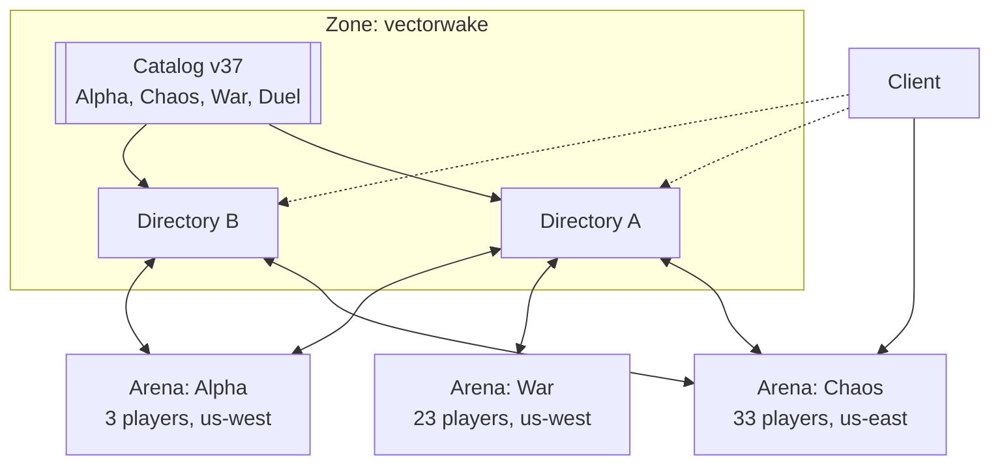

# Zones, directories, and arenas

## The thesis

The directory observes and reports. The edges decide.

An arena server decides which game it runs. A client decides which arena it
joins. Nothing in the middle assigns work, which means nothing in the middle
has to be elected, agreed with, or kept alive for the game to continue.

Everything below follows from that sentence, including the parts that look like
inconveniences.

## Vocabulary

The old model had a *zone server* hosting many named *arenas*, the way ASSS
does. The new model puts one arena in one process, which does not remove a
layer so much as move the names one seat to the left. Naming them precisely
matters more than usual here, because "zone" meaning a single room would
mislead everybody who has played the original.

**Zone.** The game a fleet presents: a name, a catalog of arena types, an
identity domain, and one or more directories. Trench Wars is a zone. This is
what Subspace meant by the word, and it is the unit a player chooses when they
choose what to play.

**Directory.** A zone's front door. It holds the token table and the catalog,
accepts arena registrations, answers browse requests, and relays what it has
observed. A zone runs several for availability. Directories never talk to each
other.

**Arena server**, or just **arena**. One process, one room, one map, one mode,
one tick loop at 100 Hz. It registers with every directory it knows, learns
what the rest of the fleet is doing, and picks its own type.

**Arena type.** A row in the catalog: a name, a map, a mode, a settings block,
a fill target. Alpha, Chaos, War, Duel. A player sees the names and nothing
else.

An arena registered with both directories carries each one's observations to the
other. The fleet's shared picture propagates through the workers rather than
between the controllers, which is why no directory needs a peer list.

## What each layer owns

| | Owns | Does not own |
|---|---|---|
| Catalog | What each type is: map, mode, settings, fill target. Bans. Versioned. | Anything about a running arena |
| Directory | Token table, its own observations, browse answers | Assignments, player state, durable records |
| Arena | One simulation, its own type choice, its players | The catalog, other arenas |
| Client | Which directory to ask, which arena to join | Nothing authoritative, as before |

## The arena lifecycle

An arena server boots knowing two things: the directories it should register
with, and its token for each. Nothing else, which is the property that makes a
fleet one container image and a horizontal scale a non-event.

1. **Register.** Connect to each directory over TLS, present the token, hold the
   socket open. The directory names the arena from the token row, so an arena
   cannot choose what it is called.
2. **Learn.** Each directory pushes what it has observed: every arena it holds a
   registration for, with type, verified player count, region, and an
   observation timestamp. The arena unions these and deduplicates by instance
   id, keeping the most recent observation of each.
3. **Choose.** Apply the selection rules below. Fetch the type's map and
   settings, which arrive as the same packed bytes a client receives at join.
4. **Serve.** Tick at 100 Hz, push status updates as counts change, answer
   direct status queries.
5. **Drain and re-choose.** Stop accepting joins, let the room empty, then go
   back to step 3.

An arena that cannot reach any directory keeps running whatever it last chose.
An arena that has never reached one runs the catalog's default type, or the
built-in arena if it has no catalog at all. Neither case is an error worth
exiting over.

## Choosing a type

The whole fleet applies the same rule to nearly the same data, which is exactly
the condition under which a correct local decision becomes a bad global outcome.
Four rules keep that from happening.

**Only an empty arena chooses.** Switching type means a new map and a new mode,
so it disconnects everyone in the room. An arena that wants to change drains
first. This is the rule that makes the rest of the design safe rather than
merely clever: instances may flap all they like while nobody is affected, and
drain time rate-limits decisions for free.

**Prefer not to exist.** An arena opens a new instance of a type only when every
live instance of that type sits above its fill target. Five War rooms holding
four players each is a worse game than one holding twenty, and concentration was
the entire point of the arena model we are replacing. Scaling out is the easy
half of autoscaling; declining to is the half that needs a rule.

**Jitter, announce, re-read.** Ten arenas booting after a deploy will all union
the same view, all conclude Alpha is underserved, and all become Alpha. So an
arena waits a random interval, announces the type it intends to take, waits
again, re-reads the union, and commits only if the announcements it can see
still leave room. This is carrier sense with collision backoff. It blunts
herding rather than eliminating it, and it is a lock protocol running over an
eventually consistent channel, which is worth saying out loud rather than
discovering later.

**Region is a preference, not a constraint.** An arena prefers to serve a type
that is underprovisioned in its own region, and falls back to global need. A
zone with one region ignores the field entirely.

## The catalog

Type definitions are the one thing that must not be gossiped. Two directories
disagreeing about which map War uses hands an arena a conflict it has no way to
resolve, and resolving it by vote is the consensus this design exists to avoid.

So the catalog is a versioned artifact with a single author, deployed to every
directory of a zone. An arena takes the highest version it is offered, logs a
mismatch when directories disagree, and keeps what it already has rather than
flapping between two definitions. This is configuration management, not
agreement: the authoring side can be down for a week and every arena keeps
serving the last version it received.

Bans live in the catalog for the same reason. They are fleet state, not
per-instance state, and a ban that applies in Chaos but not in War is a bug that
zone operators would spend real time diagnosing. This moves them out of the
`bans` list in `zone.toml`, which today is read by exactly one call site.

## Duel is the exception

A War arena is long-lived and shared. A duel is one match between two pilots,
and [decision 16](decisions.md) makes each one an ephemeral arena created on
demand. Process-per-arena fires that decision's own "reconsider if" immediately,
because process creation is milliseconds and memory rather than a hash map
insert.

So a duel arena hosts matches back to back rather than dying with each one, and
the fleet keeps a small warm pool of them sized against the queue. The type
appears in the catalog and in the player's list like any other, but what it
offers is a queue rather than a room, which is worth naming rather than
pretending the four types are symmetric.

## Joining

A client asks a directory for the catalog and the live arena list, then decides
for itself. Preferring its own region and the fullest instance below the fill
cap gives concentration a second enforcer at no cost, and gives the player the
busiest room rather than the emptiest.

The list is cacheable and worth caching. Under assignment the directory would
sit in the join path and its outage would block every join, including joins to
arenas that are running perfectly well. Reporting instead of routing means a
stale list still works: the client tries an address, gets refused if it is full
or gone, and moves to the next.

## What this deletes

The old model needed a named-arena registry, template resolution by name prefix,
per-arena configuration files, arena groups sharing score intervals, lazy
loading, unload grace periods, an arena worker pool, and a scheduler to assign
arenas to threads. None of it survives, and most of it was documented in
[server.md](server.md) without ever being built. One process holding one arena
also answers that document's open question about process isolation in the
direction that needs no code: a wedged arena takes down only itself, and the
supervisor that restarts it is whatever already restarts containers.

It also deletes four keys that `zone.toml` currently parses and nothing reads:
`arena.mode` and `arena.flags`, which lose to a hardcoded `Warzone::new(4)`;
`max_players`, which loses to a `const`; and `[[bots]]`, which loses to the
roster in `ai.rs`. Under the catalog those become type definitions that are read
because they are the only source of the answer.

## Costs

Eventually consistent scheduling means transient over- and under-provision. A
fleet will sometimes hold two half-full War rooms for a few minutes. At tens of
arenas that trade is obviously right; at hundreds the backoff starts doing
serious work and this document needs revisiting.

Population is no longer one social space by construction. ASSS got zone-wide
chat and instant arena switching for free because one process held everything;
we pay for both. Chat spanning a zone needs a hub the arenas do not provide, and
moving rooms is a reconnect rather than a message. The second is a real
regression against the original and against [server.md](server.md)'s promise
that moving between arenas does not reconnect.

Federation moves up a level. A third-party author no longer runs a zone with
their own settings; they run a *directory* with their own catalog and their own
fleet. That preserves what the research notes credit for the original's thirty
years, and arguably improves on it, since the author defines War once and the
fleet behind it is elastic. But it raises the floor on what running your own
game costs, from one binary and a config file to a catalog, a directory, and at
least one arena.

There is no global list of zones, and we are not building one. A player reaches
a zone because the client ships its directory addresses or because somebody
handed them one.
